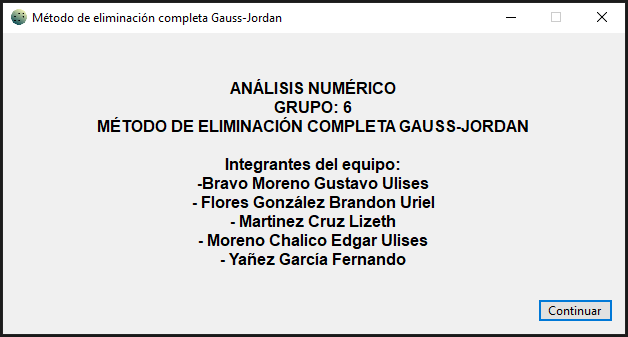
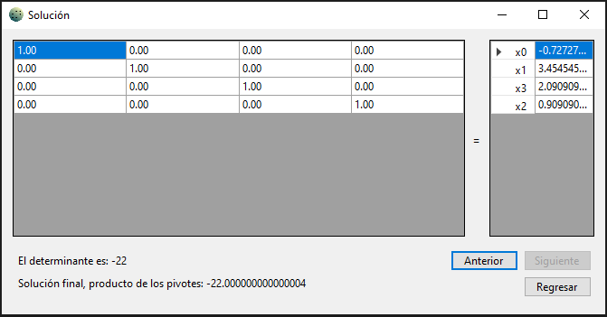

# Método de eliminación completa de Gauss-Jordan

Programa realizado para la práctica 3 de la materia Análisis Numérico (FI - UNAM), semestre 2023-1.

Las prácticas 1 y 2 están disponibles en <a href="https://github.com/EdgarsFeic96/Practicas-Analisis-Numerico">este repositorio</a>.

## Capturas

### Ventana inicial

### Creación de una matriz

### Muestra de los resultados

